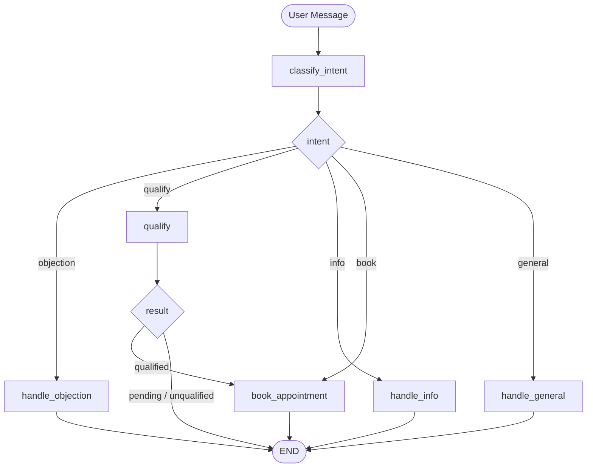
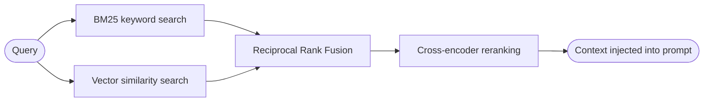

# Cato — Home Equity Agent

Cato is a domain-specialized conversational AI agent for home equity investment qualification. It serves as a reference implementation of current agentic AI architecture, and is a ground-up modernization of a prior LangChain-based prototype.

A companion evaluation harness — [llm-eval-harness](https://github.com/sud1209/llm-eval-harness) — provides automated RAG quality metrics, LLM-as-judge scoring, and CI/CD integration for this agent.

The agent qualifies homeowners for a Home Equity Investment (HEI) product offered by Shire.LLC, handles objections, answers product questions, and books advisor calls — all through a natural, single-sentence conversational style designed to feel like texting a knowledgeable friend.

---

## Architecture

### Stateful Graph Routing (LangGraph)

Every conversation turn flows through a compiled `StateGraph`. A classifier node determines intent, and conditional edges route to the appropriate handler — no hardcoded if/else chains.



Each node receives and returns a typed `CatoState` (TypedDict with `Annotated` reducers), making state transitions explicit and testable.

### Provider-Agnostic LLM (LiteLLM)

All LLM calls go through LiteLLM, which abstracts the provider behind a unified API. Switching from OpenAI to Anthropic, Gemini, or a local model is a one-line config change in `config.yaml`.

Two model tiers reduce cost and latency:
- **`gpt-4o`** — qualifier, info, objection nodes where reasoning quality matters
- **`gpt-4o-mini`** — classifier, general, booking nodes where speed matters

### Hybrid RAG

Product knowledge retrieval uses a two-stage pipeline:



BM25-only mode (`bm25_only: true` in config) skips the embedding API call for lower latency on small knowledge bases. The cross-encoder runs in a thread pool to avoid blocking the async event loop.

### 3-Tier Memory (Redis)

| Tier | Key pattern | Purpose |
|---|---|---|
| Working | `cato:working:{session_id}` | Sliding window of recent messages |
| Episodic | `cato:summary:{session_id}` | LLM-compressed rolling summary of older turns |
| Semantic | `cato:profile:{session_id}` | Persistent `UserProfile` (FICO, home value, equity, etc.) |

### Property Lookup

When a user provides their name or address, the classifier immediately queries a local SQLite database and pre-fills the `UserProfile` with home value, mortgage balance, equity percentage, and FICO score — before routing to any node, eliminating redundant qualification questions.

The DB lookup runs concurrently with the LLM classification call via `asyncio.gather`.

---

## Stack

| Layer | Technology |
|---|---|
| Agent framework | [LangGraph](https://github.com/langchain-ai/langgraph) 0.2+ |
| LLM abstraction | [LiteLLM](https://github.com/BerriAI/litellm) 1.0+ |
| Embeddings | OpenAI `text-embedding-3-large` via LiteLLM |
| Vector store | Redis + `langchain-redis` |
| BM25 | `rank-bm25` |
| Reranker | `sentence-transformers` CrossEncoder / Cohere |
| Memory & cache | Redis (async via `redis.asyncio`) |
| Property DB | SQLite |
| API server | FastAPI + SSE streaming |
| Config | `config.yaml` + Python dataclasses |
| Observability | Langfuse (optional, toggle in config) |
| Python | 3.12+ |

---

## Project Structure

```
cato-agent/
├── app/
│   ├── core/
│   │   ├── config.py           # YAML-based typed config (dataclasses)
│   │   ├── llm.py              # LiteLLM wrappers — main + fast model tiers
│   │   └── embeddings.py       # LangChain-compatible async embeddings adapter
│   ├── graph/
│   │   ├── graph.py            # LangGraph StateGraph definition
│   │   ├── state.py            # CatoState TypedDict
│   │   └── nodes/
│   │       ├── classifier.py   # Intent classification + entity extraction + DB lookup
│   │       ├── qualifier.py    # HEI eligibility assessment
│   │       ├── objection.py    # Objection handling with RAG context
│   │       ├── info.py         # Product Q&A with RAG context + profile awareness
│   │       ├── booking.py      # Advisor call scheduling
│   │       └── general.py      # Greeting / pivot to funnel
│   ├── memory/
│   │   ├── working.py          # Sliding window message history
│   │   ├── episodic.py         # Rolling LLM-generated summary
│   │   └── profile.py          # UserProfile Pydantic model with computed equity
│   ├── rag/
│   │   ├── indexer.py          # Document chunking + Redis vector indexing
│   │   ├── retriever.py        # Hybrid BM25 + vector retrieval + RRF
│   │   └── reranker.py         # Cross-encoder / Cohere reranking (thread pool)
│   ├── db/
│   │   └── property_lookup.py  # Async SQLite property + user lookup
│   ├── static/
│   │   └── index.html          # Browser chat UI (streaming SSE)
│   └── main.py                 # FastAPI app — startup, /chat endpoint, SSE streaming
├── data/
│   ├── hei_knowledge.json      # RAG knowledge base (auto-indexed on startup)
│   ├── objection_examples.json # Objection Q&A pairs
│   ├── properties.csv          # Mock property data
│   └── users.csv               # Mock user data
├── scripts/
│   ├── chat.py                 # Terminal REPL chat client
│   ├── seed_mock_db.py         # Seed properties.db from CSV files
│   ├── seed_objections.py      # Index objection examples into Redis
│   └── extract_objections.py   # Extract Q&A pairs from raw transcripts
├── tests/                      # pytest suite (fakeredis — no live deps required)
├── config.yaml                 # Single source of truth for all settings
├── .env.example                # Environment variable template
└── pyproject.toml
```

---

## Modernization vs. Prior System

The original prototype (archived in `cato-legacy/`) used LangChain agents with hardcoded routing, a single Redis vector store, and `pydantic-settings` for config. This implementation replaces that architecture throughout:

| | Legacy (`cato-legacy/`) | This implementation |
|---|---|---|
| Routing | If/else in `master.py` | LangGraph `StateGraph` with typed conditional edges |
| LLM calls | LangChain `init_chat_model` | LiteLLM — swap providers via config |
| Retrieval | Single vector similarity search | BM25 + vector + RRF + reranking |
| Memory | Redis chat history only | 3-tier: working / episodic / semantic |
| Config | `pydantic-settings` + `.env` | `config.yaml` + dataclasses |
| State | Loosely typed dict | `TypedDict` with `Annotated` reducers |
| Property lookup | LangChain tool (sync) | Async SQLite, concurrent with classification |
| Observability | None | Langfuse (optional) |
| Streaming | None | SSE via `StreamingResponse` |

---

## Getting Started

### Prerequisites

- Python 3.12+
- Redis Stack (for vector search support)
- OpenAI API key

### Redis Setup

The easiest path is Docker:

```bash
# Redis only
docker run -d -p 6379:6379 redis/redis-stack-server:latest

# Or use the included compose file (Redis + RedisInsight UI on :5540)
docker-compose up -d redis redis-insight
```

### Installation

```bash
# Install dependencies (uv recommended)
uv sync

# Copy environment template and add your key
cp .env.example .env
# Edit .env: OPENAI_API_KEY=sk-...

# Seed the property database
python scripts/seed_mock_db.py

# Start the server
uvicorn app.main:app --reload --host 0.0.0.0 --port 8000
```

On first startup the server indexes `data/hei_knowledge.json` into Redis automatically. Subsequent restarts reuse the existing index.

### Demo

**Browser** — open [http://localhost:8000](http://localhost:8000) for the streaming chat UI.

**Terminal:**
```bash
python scripts/chat.py
```

### Tests

```bash
pytest
```

Uses `fakeredis` — no live Redis or API keys required.

---

## Example Conversation

```
Cato: Hey, I'm Cato from Shire.LLC — do you own your home and have you
      thought about pulling some cash out of your equity?

You:  Yeah I own a place, but I'm not sure what home equity even is

Cato: It's the difference between what your home's worth and what you
      still owe — what would you want the cash for if you had access to it?

You:  Maybe pay off some credit card debt. But this sounds too good to be true

Cato: I get it — unlike a loan, there's no monthly payment or interest,
      you just share a slice of future appreciation when you sell.
      What specifically feels off about it?

You:  How do I know it's legit? My name is Sarah Jenkins, 1292 Oak St Phoenix

Cato: Sarah, you're at $520K with 22% equity — to qualify we'd need you
      above 30%, but want me to walk through what could get you there?
```

The agent looked up Sarah's address in the property DB, pulled her home value and equity, and moved straight to a personalized response — no redundant questions.

---

## Configuration

All settings live in `config.yaml`:

```yaml
llm:
  model: "openai/gpt-4o"            # Main model (qualifier, info, objection)
  fast_model: "openai/gpt-4o-mini"  # Fast model (classifier, general, booking)
  temperature: 0.7
  streaming: true

rag:
  retrieval_k: 10
  rerank_top_k: 3
  reranker: "local"    # "local" (CrossEncoder) or "cohere"
  bm25_only: true      # Skip vector search — lower latency for small knowledge bases

langfuse:
  enabled: false       # Set true + add keys to enable LLM call tracing
  public_key: ""
  secret_key: ""
```

**Switching LLM provider** — change `model` to any [LiteLLM-supported](https://docs.litellm.ai/docs/providers) identifier:

```yaml
llm:
  model: "anthropic/claude-opus-4-6"
  fast_model: "anthropic/claude-haiku-4-5-20251001"
```

**Environment variables** (see `.env.example`):

| Variable | Required | Purpose |
|---|---|---|
| `OPENAI_API_KEY` | Yes | LLM + embeddings calls |
| `COHERE_API_KEY` | If `reranker: "cohere"` | Cohere reranking API |
| `LANGFUSE_PUBLIC_KEY` | If `langfuse.enabled: true` | Observability |
| `LANGFUSE_SECRET_KEY` | If `langfuse.enabled: true` | Observability |

---

## Extending the Graph

### Adding a new intent + node

1. **Create the node** in `app/graph/nodes/my_node.py`:

```python
from app.core.llm import chat_completion
from app.graph.state import CatoState

async def handle_my_intent(state: CatoState) -> dict:
    messages_payload = [
        {"role": "system", "content": "You are Cato ..."},
        *[{"role": "user" if m.type == "human" else "assistant",
           "content": m.content} for m in state["messages"]],
    ]
    response = await chat_completion(messages_payload, temperature=0.4)
    from langchain_core.messages import AIMessage
    return {"messages": [AIMessage(content=response)]}
```

2. **Register it in `app/graph/graph.py`**:

```python
from app.graph.nodes.my_node import handle_my_intent

# In build_graph():
builder.add_node("handle_my_intent", handle_my_intent)
builder.add_edge("handle_my_intent", END)
```

3. **Add the route** in `_route_after_classify`:

```python
if intent == "my_intent":
    return "handle_my_intent"
```

4. **Update the classifier prompt** in `app/graph/nodes/classifier.py` to include the new intent label and examples.

### Extending the knowledge base

Add entries to `data/hei_knowledge.json` following the existing format:

```json
{
  "content": "Your knowledge chunk here.",
  "metadata": {"category": "your_category"}
}
```

Restart the server — indexing runs on startup automatically.

---

## Limitations & Scope

This is a functional proof of concept demonstrating agent architecture patterns. A few things to be aware of before treating it as production-ready:

- **Mock data only** — `properties.db` is seeded from synthetic CSV data covering Phoenix, AZ. The property lookup will not find addresses outside this dataset.
- **No API authentication** — the `/chat` endpoint is open. Session IDs are client-provided strings with no server-side validation.
- **No rate limiting** — there is no throttling on LLM calls or the API.
- **Fictional company** — Shire.LLC and its HEI product parameters are illustrative. The knowledge base is adapted from a template, not real product documentation.
- **Placeholder booking** — the Calendly link in the booking node (`calendly.com/shirellc/advisor`) is a placeholder. There is no actual calendar integration.
- **CrossEncoder cold start** — `BAAI/bge-reranker-base` (~270MB) downloads from HuggingFace on first run and caches locally. Subsequent starts use the cache.
- **Single-process state** — the CrossEncoder is cached as a module-level singleton, which works for a single-process deployment but would need rethinking behind a multi-worker setup.
- **No multi-tenancy** — the SQLite property DB is a single shared file with no per-tenant isolation.

---

## Evaluation

Automated quality measurement for this agent is handled by [llm-eval-harness](https://github.com/sud1209/llm-eval-harness) — a companion repo that runs RAGAS metrics (faithfulness, answer relevance, context recall, context precision), LLM-as-judge scoring, and drift detection against a suite of 40 domain-specific test cases. It integrates as a GitHub Actions CI gate that blocks PRs degrading response quality below configured thresholds.

---

## License

MIT — do whatever you want with it. Attribution appreciated but not required.
